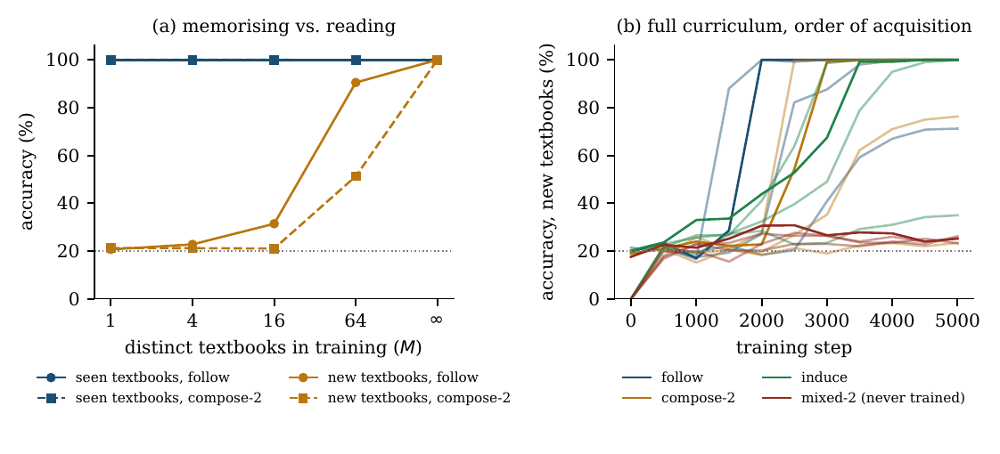
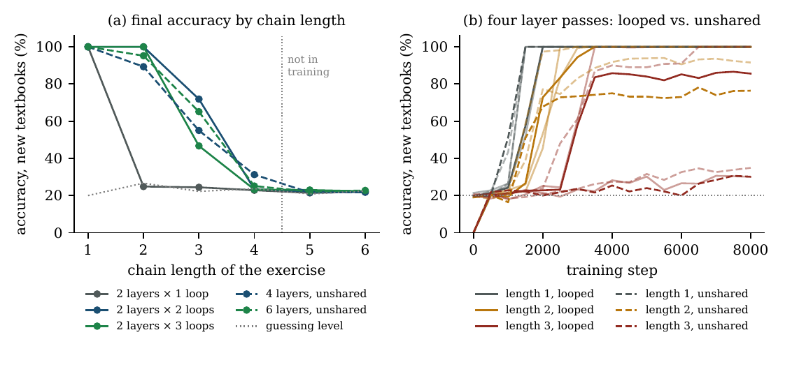

# Know Less, Read More

**Toward a Minimal Base Curriculum for Small In-Context Learners**

Code, logs and paper for a pilot study on one question: how little does a small
language model need to store in its weights if the rest can be read from its context?

📄 [Read the paper (PDF)](paper/know-less-read-more.pdf)

## The idea

Small models are usually judged by how much they know. This project asks the opposite
question. A student with a textbook does not memorise the theorems. She needs to be able
to read a definition, apply a stated rule, chain two rules, and check an answer. The
theorems stay in the book.

The paper calls the skills that must be in the weights the **base curriculum**, proposes
a six-layer candidate for it, and tests part of it with a synthetic benchmark.

| Layer | The model can... |
|---|---|
| C0 Parsing | segment the material and bind names to what they denote |
| C1 Primitives | copy, retrieve a value by its key, compare, do small arithmetic |
| C2 Rule following | apply a rule the material states explicitly |
| C3 Rule induction | infer a rule the material only shows through examples |
| C4 Composition | chain several rules |
| C5 Verification | check an answer, abstain when the material does not decide it |

## TinyTextbook

Every episode is a small "textbook" followed by exercises. The rules are resampled for
every episode, so memorising them is useless.

```
Material                              Exercises
  row of f1:  c e d a b                 follow    Q F2 a      = e
  row of f2:  e b c a d                 compose   Q F1 F2 d   = c    f1(f2(d))
  row of f3:  a c d e b                 induce    Q G a       = c    g shifts by two
  examples of g:  c e   b d             mixed     Q G F3 a    = c    never trained
```

## What the pilot found

38 runs, transformers of about 113 thousand parameters, 5.4 CPU-hours, no GPU.

**1. Memorising vs. reading.** Models trained on 16 or fewer distinct textbooks answer
perfectly on those textbooks and at or near chance on new ones. With an unlimited supply
of textbooks they reach 100% on new ones. Accuracy on seen textbooks looks the same in
both cases.

**2. Each skill has to be trained, and the simplest one comes first.** A skill left out
of training stays at its guessing level. Without single look-ups in training, composition
was solved in 0 of 4 runs, against 6 of 8 runs with them (one-sided Fisher exact test,
p = 0.030).

**3. Trained skills do not combine by themselves.** No run exceeded 26.2% on exercises
that mix two separately trained skills. Guessing reaches 26.7%.

**4. Loops buy depth without parameters.** Applying the same two layers twice let the
model follow longer chains with no parameters added. At equal depth, looped and unshared
models showed no consistent difference across seeds.

**5. A symmetric training set holds the reading skill back.** With training tables that
are permutations, 0 of 3 seeds learned to look a value up. With arbitrary maps, 3 of 3
did.





### Leave-one-skill-out (E2)

Accuracy (%) on new textbooks, mean over 4 seeds. In parentheses: seeds that ended at 95%
or above.

| Training set | follow | compose-2 | induce | mixed-2 (never trained) |
|---|---|---|---|---|
| Full curriculum | 92.8 (3/4) | 74.9 (2/4) | 83.7 (3/4) | 25.0 (0/4) |
| without follow | 19.7 (0/4) | 25.3 (0/4) | 81.4 (2/4) | 22.0 (0/4) |
| without compose | 73.8 (2/4) | 19.5 (0/4) | 99.8 (4/4) | 20.0 (0/4) |
| without induce | 100.0 (4/4) | 100.0 (4/4) | 20.4 (0/4) | 17.0 (0/4) |

## Limitations

Read these before citing a number.

- **Scale.** The models have 113k to 313k parameters. Nothing here is evidence about
  models with 100 million.
- **Retrieval by address, not by content.** All results use a fixed page layout in which
  a value is found by its position. The harder version, where facts are free-standing and
  must be found by content, was not learned within the training budget.
- **Seed noise.** Conditions have one to four seeds. Learning happens in abrupt steps
  whose timing varies between seeds, so results are reported as counts of seeds.
- **One synthetic domain.** Five symbols, four functions, no natural language.

## Running it

Requirements: Python 3.10+, PyTorch, NumPy, Matplotlib. A CPU is enough. The paper's runs
used PyTorch 2.14, NumPy 2.5 and Matplotlib 3.11.

```bash
pip install -r requirements.txt

python tinytextbook.py --exp e1 --seed 0 --out results   # memorising vs. reading
python tinytextbook.py --exp e2 --seed 0 --out results   # leave-one-skill-out
python tinytextbook.py --exp e3 --seed 0 --out results   # recurrent depth
python tinytextbook.py --exp e4 --seed 0 --out results   # permutations vs. arbitrary maps

python make_results.py results paper/source/gen          # tables, figures, numbers
```

A run takes between 6 and 23 minutes on one CPU core. A run whose JSON file already
exists in the output folder is skipped, so use a new folder to rerun from scratch.

Useful flags:

| Flag | Effect |
|---|---|
| `--only tied_2x2,untied_4` | run a subset of conditions |
| `--seed 1` | another seed |
| `--steps`, `--d`, `--layers`, `--loops`, `--lr`, `--bs` | override the defaults |
| `TT_LAYOUT=shuffled` (environment) | free-standing facts that must be found by content |

The shuffled layout is the open problem. It was not learned in the pilot and is the first
thing to solve at larger scale.

## Repository layout

| Path | Contents |
|---|---|
| `tinytextbook.py` | episode generator, model, training loop, the four experiments |
| `make_results.py` | regenerates every table, figure and number in the paper from the logs |
| `guess_levels.py` | exact accuracy of a guesser that sees the exercise but not the tables |
| `results/` | one JSON file per run: configuration, final accuracy, accuracy during training |
| `logs/` | raw console output of the runs |
| `logs/exploratory/` | three retained logs of exploratory runs (Appendix C of the paper) |
| `paper/` | the PDF and its LaTeX source |
| `figures/` | the figures used in this README |

## Next step

Section 7 of the paper gives a protocol with falsifiable hypotheses for repeating the
study at 10 to 100 million parameters, where the question has practical consequences.

## Citation

```bibtex
@misc{davitotty2026knowless,
  title  = {Know Less, Read More: Toward a Minimal Base Curriculum for Small In-Context Learners},
  author = {Davitotty1},
  year   = {2026},
  note   = {Preprint}
}
```

## AI assistance

This work made substantial use of a large language model (Claude, Anthropic) for
literature search, drafting, code and running the experiments. The research question and
the central idea are the author's. Details are in the paper's disclosure section.
